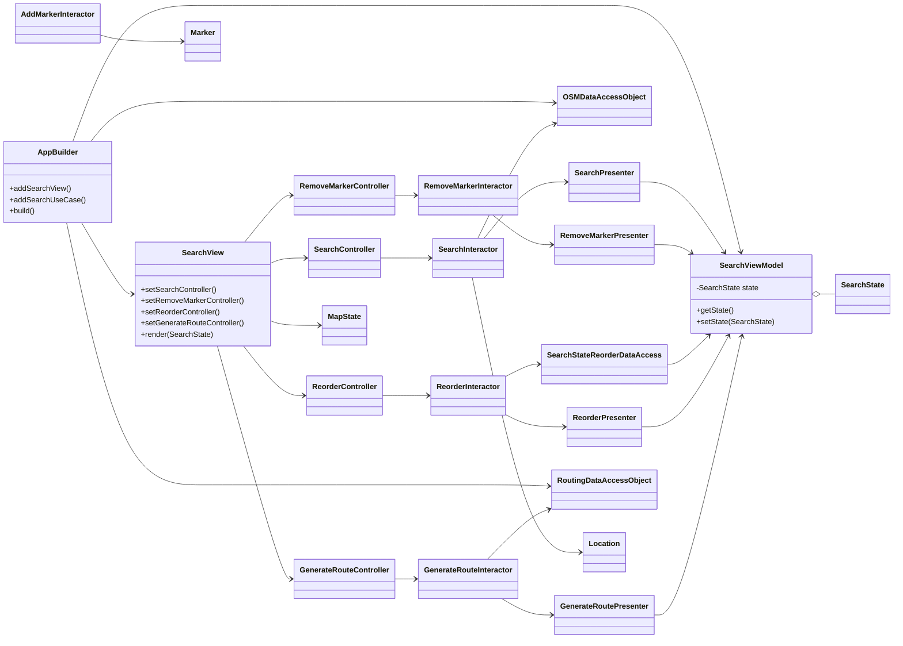
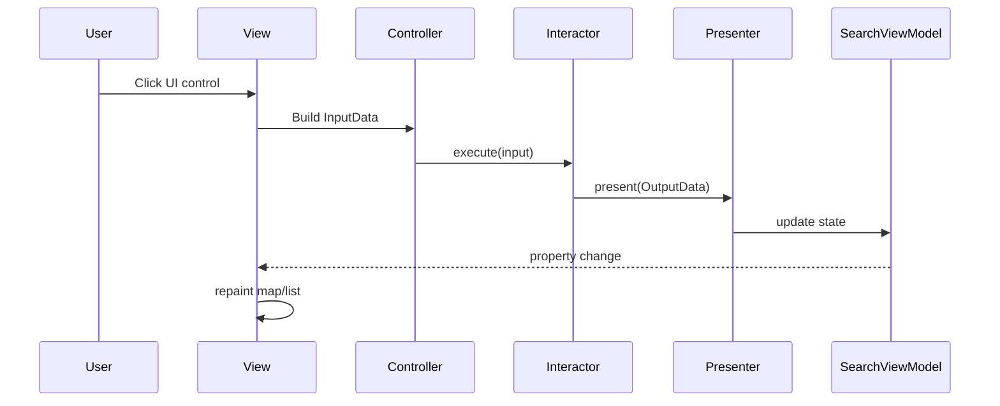

# UML Diagram

The diagrams below summarize the high-level Clean Architecture wiring for SwingTripPlanner and how the five use cases collaborate with the view layer.

These diagrams highlight that each user-facing action flows through a controller into an interactor, then back through a presenter to update the shared `SearchViewModel`, which triggers the Swing view to refresh its components.
